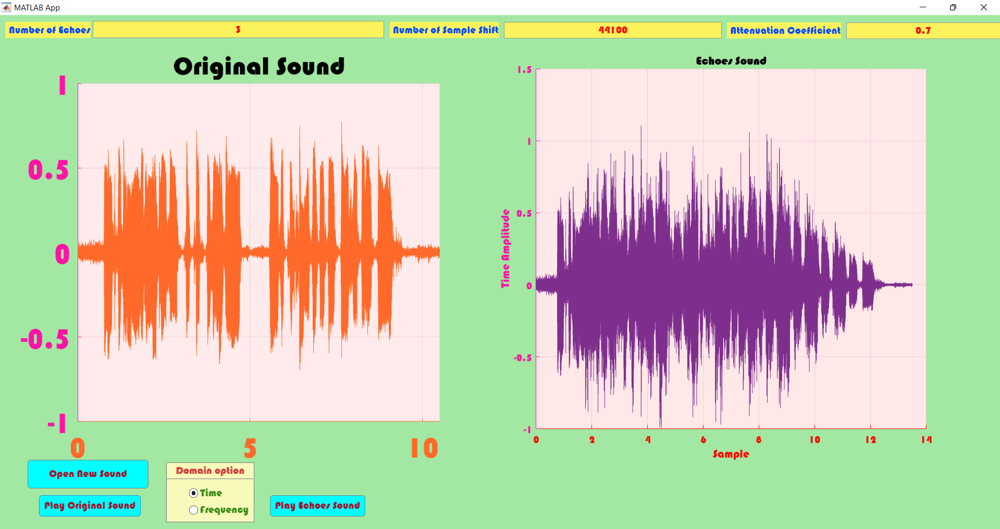

# Untitled

# ***Echo Effect Simulation***

## ***(Alireza Tabatabaeian)***

### ***Introduction:***

**Echo is a phenomenon that occurs when a sound is reflected off a surface and heard again by the listener. In audio systems, echo can be a problem as it can degrade the quality of the sound and make it difficult to understand speech. Echo cancellation is a technique used to reduce or eliminate echo in audio systems.**

**In Matlab, there are several built-in functions and toolboxes that can be used for echo cancellation. The most common method is to use the Adaptive Filtering Toolbox, which includes the lms and rls algorithms for adaptive filtering. These algorithms are used to estimate the impulse response of the echo path and then adapt the filter coefficients to minimize the echo.**

**Another method is to use the Signal Processing Toolbox, which includes the nlms and nrls algorithms for non-linear adaptive filtering. These algorithms are similar to the lms and rls algorithms, but they use a non-linear function to estimate the impulse response of the echo path.**

**It is also possible to implement echo cancellation using the Audio System Toolbox, which includes functions for audio processing and analysis. This toolbox can be used to perform echo cancellation on audio signals, as well as other audio processing tasks such as noise reduction and equalization.**

**In addition to these built-in functions and toolboxes, it is also possible to implement echo cancellation using custom code. This can be done by using the basic principles of adaptive filtering and signal processing to design and implement an echo cancellation algorithm.**

### ***Implementation:***

**In this project, we’ve simulated the echo response adding to the original signal in app designer, the new UI design tools in MATLAB. Echoes are made using an attenuation and a shift in time domain.**

**Then we’ve plot the time and frequency response of each.**

**The result will be shown on the below:**

